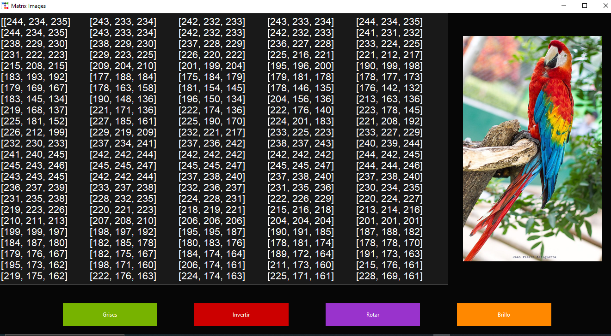

<h1>MatrixImg</h1>

Array maniupulation for image processing

<h2>Tecnologies</h2>
<ul>
    <li>Python</li>
    <li>tkinter</li>
    <li>ttkbootstrap</li>
    <li>numpy</li>
</ul>

<h2>About</h2>

It is known that images are an array of pixels. Each index of the
array represent a pixel, and every pixel contains 3 RGB values.

We can manipulate these pixels by doing some operations with the array, 
such as setting a gray scale filter, adding brightness, rotation or many
other filters.

This is a university project (UNMSM - Peru), the objective is to show
how we can manipulate an image array to apply some filters

<h2>How to use</h2>
<ol>
    <li>Clone this repository using this link: <a href="https://github.com/LTprograms/MatrixImg.git">https://github.com/LTprograms/MatrixImg.git</a></li>
    <li>Make sure you have Pyuthon installed in your computer, if not, download using this <a href="https://www.python.org/downloads/" target="_blank">link</a></li>
    <li>Add python to the PATH if you have not already done</li>
    <li>Install ttkbootstrap to use this app, you can use the command in any terminal: <i>pip install ttkbootstrap</i></li>
    <li>You will also need Pillow and Numpy libraries, use the following commands to install them: <i>pip install numpy</i> & <i>pip install pillow</i></li>
    <li>Go to you proyect directory and run your application, you can use <i>python app.py</i> to run it or any other method you want</li>
</ol>

<h2>How it works</h2>

We have this GUI with 3 sections:
<ul>
    <li>Image section</li>
    <li>Array image</li>
    <li>Button section</li>
</ul>
For this version we only have 4 operations (Gray Scale - Inverse - Rotation - Brightness). It is hoped in the future add more customized operations.

